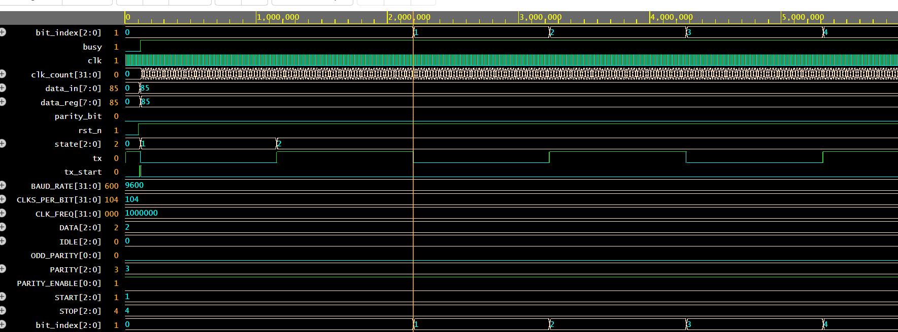
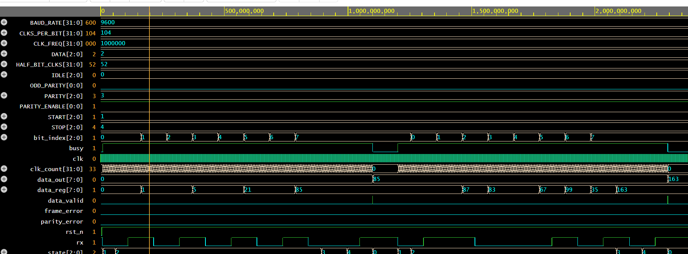

# UART_PROJECT
## INTRODUCTION

Verilog implementation of a UART transmitter and receiver with independent testbenches for simulation

UART stands for Universal Asynchronous Receiver/Transmitter. It’s not a communication protocol like SPI and I2C, but a physical circuit in a microcontroller, or a stand-alone IC.

A UART’s main purpose is to transmit and receive serial data. In UART communication, two UARTs communicate directly with each other. The transmitting UART converts parallel data from a controlling device like a CPU into serial form, and transmits it in serial to the receiving UART, which then converts the serial data back into parallel data for the receiving device.

Only two wires are needed to transmit data between two UARTs. Data flows from the transmitting UART's Tx pin to the receiving UART's Rx pin.

## BAUDRATE GENREATOR UNIT :

**Baud Rate:** is the rate at which the number of signal elements or changes to the signal occurs per second when it passes through a transmission medium. The higher the baud rate, the faster the data is sent/received.

This unit supports four possible baud rates:

- Baud rate of 2400 bps

- Baud rate of 4800 bps
  
- Baud rate of 9600 bps
  
- Baud rate of 19200 bps

## UART PROTOCOL DATA FLOW :

These special bits are: Start bit, Priority bit, Stop bit.

**START BIT:** When a word is given to UART for asynchronous transmission, a bit called “START BIT” is added to the beginning of each word that is to be transmitted. 
The start bit is used to alert the receiver that a word of data is about to sent, and to force the clock in the receiver into synchronization with the clock in the transmitter.

**DATA BIT OR DATA FRAME:** After the start bit, the individual bits of data are sent, with the least significant Bit(LSB) being sent first. Each bit in the transmission is transmitted for exactly the same amount of time as all of the other bits. And the receiver looks at the wire at approximately halfway through the period assigned to each bit to determine if the bit is 1 or 0. For example, if it takes 2 second to send each bit, the receiver will track the signal after 1 second has passed.

**PARITY BIT:** remove the problem of loss of some bits during the transmission of a signal, error correction mechanism must be added to the transmitted data. Parity bit error checking mechanism is one of the simplest methods to detect any error in received data. In asynchronous serial communication, a parity bit is added at the end of data bits to check the number of 1’s.

**STOP BIT:** At the end of each data packet, stop bit i.e. 1 is added to indicate the end of one data packet. At the receiver end, this stop bit is used to stop the reception of Data.

## WORKING OF UART :

- The transmitting UART converts parallel data from a controlling device like a CPU into serial form.

- Transmitting it in serial to the receiving UART.

- Receiver UART then converts the serial data back into parallel data for the receiving device.

- Only two wires are needed to transmit data between two UARTs.

- Data flows from TX pin of the transmitting UART to the Rx pin of the receiving UART.

- UART transmit data asynchronously, which means there is no need to transmit clock signal with the transmitted data.

- Instead of clock, the transmitter transmit data with some special bits to synchronize the sending and receiving units.

- These bits define the beginning and end of the data packet so the receiving UART knows when to start and stop reading the bits.

- As soon as the start bit is detected, the receiver observe the start bit for 50[percent]of the receiving baud rate, if it is the receiver start sampling other data bits at the middle of each bit otherwise receiver set flag for framing error. After detecting the 8 bit data, the receiver then looks for the parity bit which is generated by the transmitter for the single bit error detection.

- If the parity bit is detected properly, the receiver looks for the stop bit to stop the reception of data.

- After the successful detection of stop bit the receiver line goes high logic state to indicate idle state and start looking for the next start bit.

The UART that is going to transmit data receives the data from a data bus. The data bus is used to send data to the UART by another device like a CPU, memory, or microcontroller. Data is transferred from the data bus to the transmitting UART in parallel form. After the transmitting UART gets the parallel data from the data bus, it adds a start bit, a parity bit, and a stop bit, creating the data packet. Next, the data packet is output serially, bit by bit at the Tx pin.

The receiving UART reads the data packet bit by bit at its Rx pin. The receiving UART then converts the data back into parallel form and removes the start bit, parity bit, and stop bits. Finally, the receiving UART transfers the data packet in parallel to the data bus on the receiving end:

## TRANSMITTER :

This module sends one UART frame whenever tx_start becomes high while the transmitter is idle. A UART TX line stays at logic 1 when nothing is being transmitted, so after reset tx is set to 1, busy is 0, and the FSM enters the IDLE state.

The parameters define the system clock frequency and UART baud rate. For example, with a 50 MHz clock and 115200 baud rate, CLKS_PER_BIT is approximately 434. That means every UART bit—start bit, each data bit, parity bit, and stop bit—is held for 434 system-clock cycles.

The FSM has five states: IDLE, START, DATA, PARITY, and STOP. 
The state register stores the current state. clk_count measures how long the current UART bit has been on the tx output. bit_index selects which data bit is currently being sent, and it is correctly three bits wide because it only needs values from 0 to 7.

In the IDLE state, the transmitter waits for tx_start. When tx_start is asserted, data_in is copied into data_reg. This is important because data_in may change while transmission is in progress, but the transmitted byte must remain unchanged. At the same time, the parity bit is calculated. For even parity, ^data_in is used; this makes the total number of 1s in the data plus parity bit even. For odd parity, the XOR result is inverted using ~(^data_in).

After accepting the byte, the FSM immediately drives tx low. This is the UART start bit, and the FSM moves to START. The line remains low until clk_count reaches CLKS_PER_BIT - 1, meaning one full UART bit period has passed.

The FSM then enters DATA and sends the data bits from least-significant bit to most-significant bit, which is the UART convention. It first sends data_reg[0], then data_reg[1], continuing until data_reg[7].
The line:
## tx <= data_reg[bit_index + 3'd1];
selects the next data bit. It is only executed while bit_index is below 7. When bit_index reaches 7, bit 7 has already been placed on tx and held for one baud period, so the FSM moves on instead of accessing an invalid bit.

After sending all eight data bits, the FSM either sends the calculated parity bit in the PARITY state, or skips directly to STOP if PARITY_ENABLE is 0. The parity bit is also held for exactly one bit period.
Finally, in the STOP state, tx is driven back to 1 for one bit period. Once this stop-bit duration finishes, busy returns to 0 and the FSM returns to IDLE, ready to transmit the next byte.

Idle(1) → Start(0) → D0 → D1 → D2 → D3 → D4 → D5 → D6 → D7 → Parity → Stop(1)

## RECEIVER :

The UART receiver accepts serial data through the rx input and converts it back into an 8-bit parallel value on data_out. UART communication normally keeps the serial line at logic 1 when no data is being sent. The receiver stays in the IDLE state while rx is high and waits for the line to go low.

When rx becomes 0, the receiver assumes that a start bit may have arrived. It does not immediately trust this transition, because it could be caused by noise. Instead, it waits for half of one UART-bit period and checks rx again in the middle of the expected start bit. If the line is still low, the start bit is valid and the receiver moves to the DATA state. If the line has returned high, it treats it as a false start and goes back to IDLE.

With a 1 MHz system clock and 9600 baud rate, one UART bit takes approximately 104 clock cycles. The receiver samples every bit after waiting for 104 clocks. Sampling close to the middle of a bit gives the receiver the best chance of reading the correct value even if there is slight timing difference between transmitter and receiver.

In the DATA state, the receiver reads eight bits from the rx line. UART sends the least-significant bit first, so the first sampled bit is stored in data_reg[0], the next in data_reg[1], and this continues until data_reg[7]. The bit_index register tracks which data bit is currently being received. It is three bits wide because it only needs to count from 0 to 7.

After receiving all eight data bits, the receiver enters the PARITY state when parity is enabled. In this state, it samples the parity bit and compares it with the expected parity value calculated from the received data. For even parity, the total number of logic 1 values in the eight data bits plus the parity bit must be even. If the received parity bit is different from the expected value, parity_error becomes 1.

The receiver then enters the STOP state. A valid UART stop bit must be logic 1. If rx is high when the stop bit is sampled, the receiver copies data_reg into data_out and pulses data_valid high for one clock cycle. This pulse indicates that a complete valid UART frame has been received. If the stop bit is low, the receiver sets frame_error to 1, meaning that the frame format is incorrect.

The busy output becomes high after a valid start bit is detected and remains high until the receiver has processed the stop bit. Once the frame is complete, the receiver returns to the IDLE state and waits for the next UART start bit.

