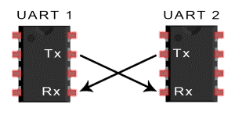
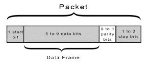
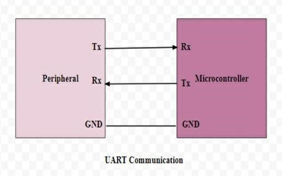

# UART_PROJECT
## INTRODUCTION

Verilog implementation of a UART transmitter and receiver with independent testbenches for simulation

UART stands for Universal Asynchronous Receiver/Transmitter. It’s not a communication protocol like SPI and I2C, but a physical circuit in a microcontroller, or a stand-alone IC.

A UART’s main purpose is to transmit and receive serial data. In UART communication, two UARTs communicate directly with each other. The transmitting UART converts parallel data from a controlling device like a CPU into serial form, and transmits it in serial to the receiving UART, which then converts the serial data back into parallel data for the receiving device.

Only two wires are needed to transmit data between two UARTs. Data flows from the transmitting UART's Tx pin to the receiving UART's Rx pin.

## BAUDRATE GENREATOR UNIT :

**Baud Rate:** is the rate at which the number of signal elements or changes to the signal occurs per second when it passes through a transmission medium. The higher the baud rate, the faster the data is sent/received.

This unit supports four possible baud rates:

- Baud rate of 2400 bps

- Baud rate of 4800 bps
  
- Baud rate of 9600 bps
  
- Baud rate of 19200 bps

## UART PROTOCOL DATA FLOW :

These special bits are: Start bit, Priority bit, Stop bit.

**START BIT:** When a word is given to UART for asynchronous transmission, a bit called “START BIT” is added to the beginning of each word that is to be transmitted. 
The start bit is used to alert the receiver that a word of data is about to sent, and to force the clock in the receiver into synchronization with the clock in the transmitter.

**DATA BIT OR DATA FRAME:** After the start bit, the individual bits of data are sent, with the least significant Bit(LSB) being sent first. Each bit in the transmission is transmitted for exactly the same amount of time as all of the other bits. And the receiver looks at the wire at approximately halfway through the period assigned to each bit to determine if the bit is 1 or 0. For example, if it takes 2 second to send each bit, the receiver will track the signal after 1 second has passed.

**PARITY BIT:** remove the problem of loss of some bits during the transmission of a signal, error correction mechanism must be added to the transmitted data. Parity bit error checking mechanism is one of the simplest methods to detect any error in received data. In asynchronous serial communication, a parity bit is added at the end of data bits to check the number of 1’s.

**STOP BIT:** At the end of each data packet, stop bit i.e. 1 is added to indicate the end of one data packet. At the receiver end, this stop bit is used to stop the reception of Data.

## WORKING OF UART :

- The transmitting UART converts parallel data from a controlling device like a CPU into serial form.

- Transmitting it in serial to the receiving UART.

- Receiver UART then converts the serial data back into parallel data for the receiving device.

- Only two wires are needed to transmit data between two UARTs.

- Data flows from TX pin of the transmitting UART to the Rx pin of the receiving UART.

- UART transmit data asynchronously, which means there is no need to transmit clock signal with the transmitted data.

- Instead of clock, the transmitter transmit data with some special bits to synchronize the sending and receiving units.

- These bits define the beginning and end of the data packet so the receiving UART knows when to start and stop reading the bits.

- As soon as the start bit is detected, the receiver observe the start bit for 50[percent]of the receiving baud rate, if it is the receiver start sampling other data bits at the middle of each bit otherwise receiver set flag for framing error. After detecting the 8 bit data, the receiver then looks for the parity bit which is generated by the transmitter for the single bit error detection.

- If the parity bit is detected properly, the receiver looks for the stop bit to stop the reception of data.

- After the successful detection of stop bit the receiver line goes high logic state to indicate idle state and start looking for the next start bit.

The UART that is going to transmit data receives the data from a data bus. The data bus is used to send data to the UART by another device like a CPU, memory, or microcontroller. Data is transferred from the data bus to the transmitting UART in parallel form. After the transmitting UART gets the parallel data from the data bus, it adds a start bit, a parity bit, and a stop bit, creating the data packet. Next, the data packet is output serially, bit by bit at the Tx pin.

The receiving UART reads the data packet bit by bit at its Rx pin. The receiving UART then converts the data back into parallel form and removes the start bit, parity bit, and stop bits. Finally, the receiving UART transfers the data packet in parallel to the data bus on the receiving end:

